# 과제 제출 방법

1. **Repository 클론**

   ```bash
   git clone https://github.com/inu-appcenter/server-study-12.5th.git
   ```

   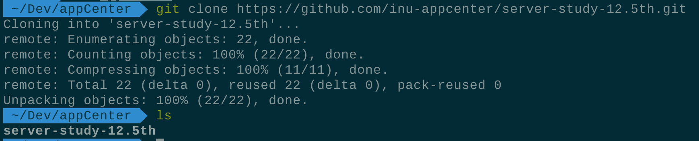

   레포 클론 성공

2. **Repository 이동 후 branch 생성**

   브랜치 이름은 자신의 이름으로 만들어주세요.

   ```bash
   cd server-study-12.5th
   git branch <브랜치 이름>
   git branch (-l)
   ```

   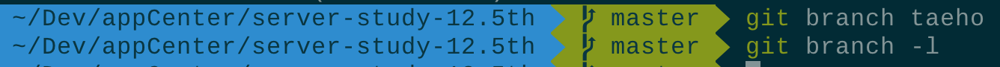

   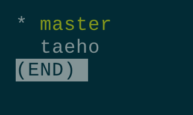

   확인 후 wq

3. **브랜치 이동**

   ```bash
   git checkout <브랜치 이름>
   # 생성과 동시에 이동하기
   # git checkout -b <브랜치 이름>
   ```

   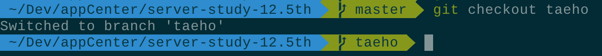

   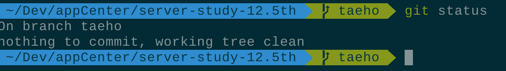

4. **과제 작성**

   vscode 실행해서 저장소를 열어줍니다.

   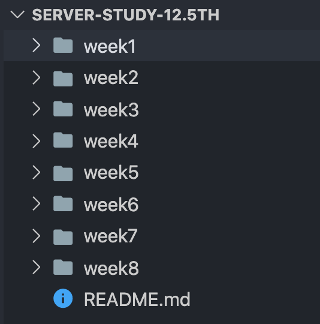

   (1주차 예시) `<이름>.week1.js` 생성

   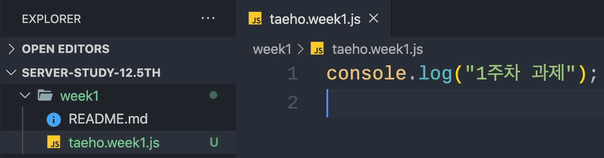

   과제 완료 후 커밋합니다.

   ```bash
   git status # 상태 확인
   git add week1\<이름>.week1.js # git add .
   git commit -m "Add: 임태호 1주차 과제"
   ```

   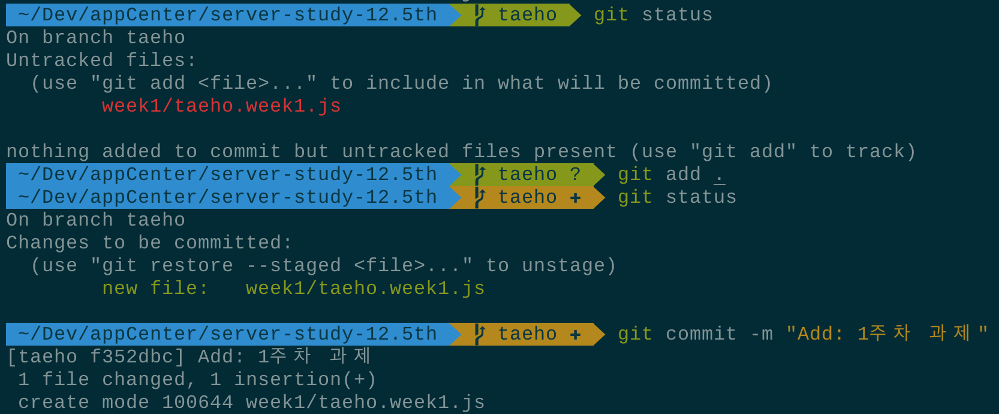

5. **생성한 브랜치에 push**

   ```bash
   git push origin <브랜치 이름>
   ```

   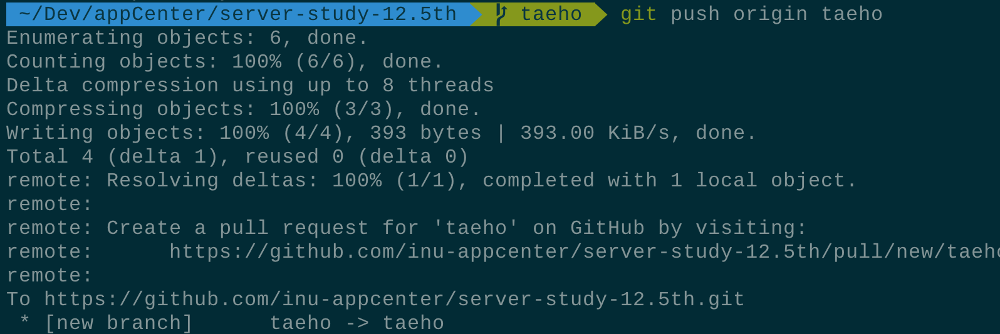

6. **깃허브 원격저장소에 브랜치 확인 후 pull request**

   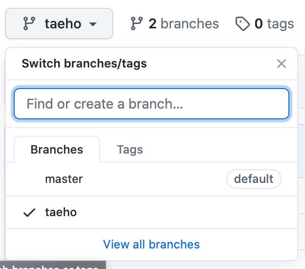

   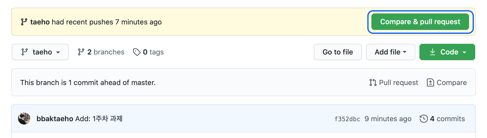

   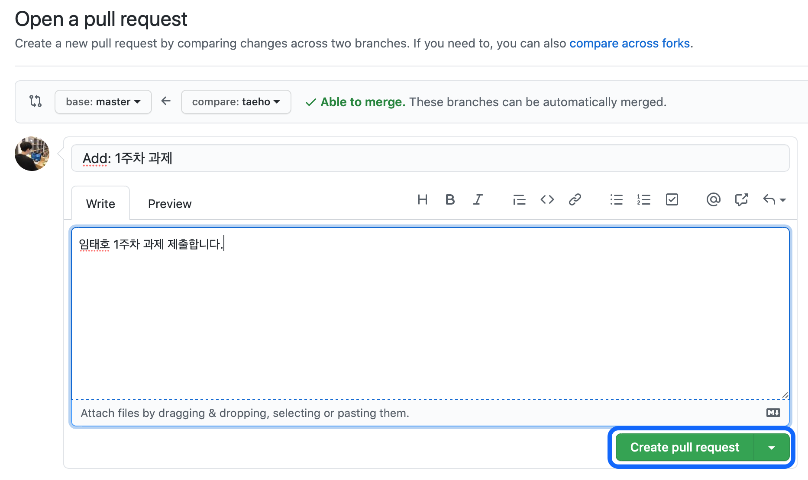
